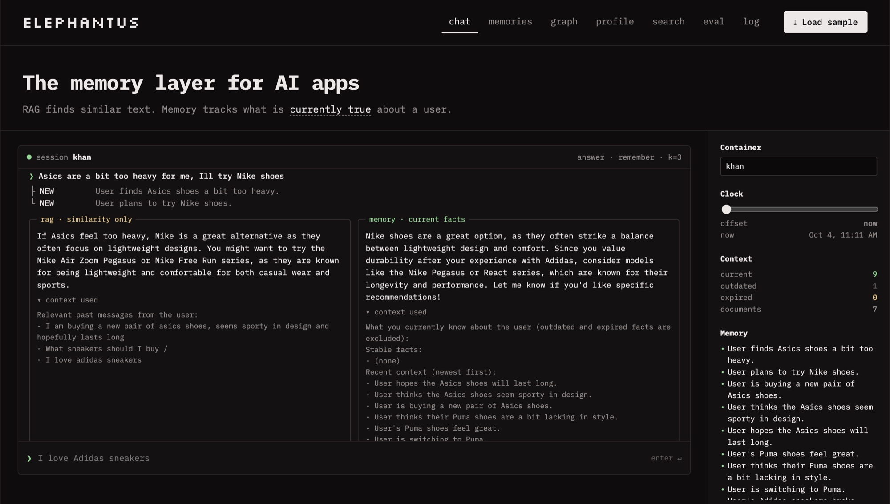
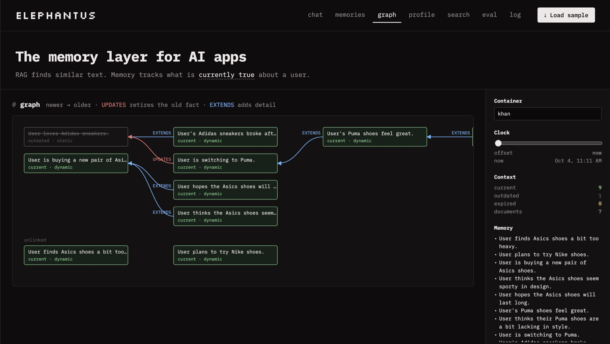
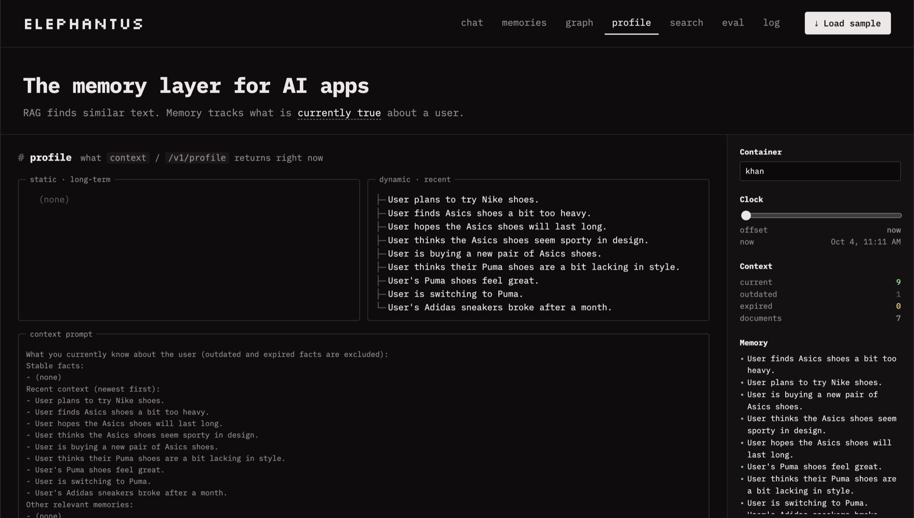
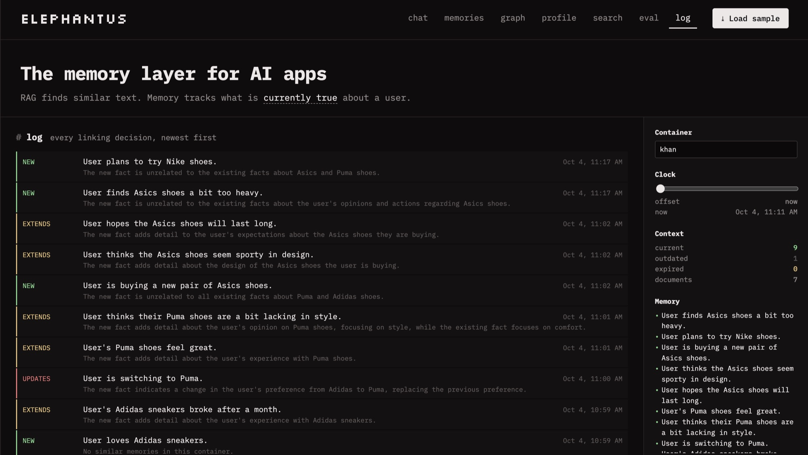
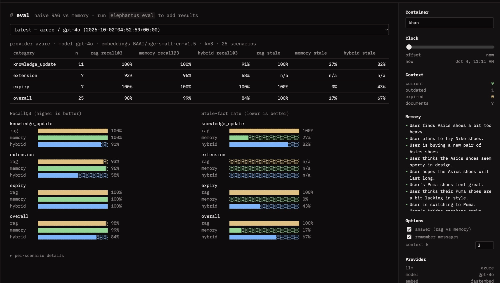

+++
title = "Elephantus: a Memory Layer for AI Apps"
description = "A small, local memory layer for AI apps. It turns messages into atomic facts, links each new fact to what it already knows, and tracks what is currently true about a user. Available over REST, MCP and a terminal-style web UI."
date = 2026-10-04
authors = ["Mohammed Akram Khan Lodi"]

[taxonomies]
tags = ["memory", "RAG", "LLM", "MCP", "agents"]

[extra]
banner = "banner.png"
no_card_tint = true
toc = true
+++

<ul class="link-row">
<li><a href="https://github.com/akramlodi/elephantus">Code on GitHub</a></li>
</ul>

> **RAG finds similar text. Memory tracks what is *currently true* about a user.**

Elephantus is a small memory engine for AI apps that runs on your own machine. You send it messages; it pulls out short facts about the user, links each new fact to the ones it already has, and keeps track of which facts are still true. You can use it from a REST API, from Claude Desktop over MCP, or from a terminal-style web UI.

*An elephant never forgets, but it does know which of its memories are out of date.*

<figure>
<video src="demo.mp4" poster="demo-poster.jpg" controls muted playsinline preload="metadata" width="100%"></video>
<figcaption>A walkthrough of the web UI: chat, linking decisions, the memory graph, and the RAG-vs-memory comparison.</figcaption>
</figure>

## The problem: similarity isn't truth

Suppose a user tells an assistant three things over a few weeks:

1. "I love Adidas sneakers"
2. "My Adidas broke after a month"
3. "I'm switching to Puma"

Later they ask, **"What sneakers should I buy?"**

- **Naive RAG** stores the raw messages and fetches the ones most *similar* to the question. "I love Adidas sneakers" is the closest match (it even contains the word *sneakers*), so the assistant recommends **Adidas**. Similarity says nothing about whether a fact is still true.
- **Memory** turns each message into atomic facts and compares every new fact with what it already knows. "User is switching to Puma" **updates** "User loves Adidas sneakers". The old fact is marked outdated: it's kept for history but never retrieved again. The assistant recommends **Puma**.

Most "memory" features in AI apps are really retrieval over a chat log. That works until the user changes their mind, and people change their minds all the time. I built Elephantus to make that difference concrete and measurable.

## How it works

### The engine

<div class="table-scroll">

| Concept | What it does |
|---|---|
| **Documents vs memories** | Raw messages are stored and chunked (that's the RAG baseline). An LLM extracts short, atomic **memories** from them. |
| **Container tags** | Every document and memory belongs to a `container_tag` (for example `khan` or `work`). Tags never mix, not even during linking. |
| **Relationships** | Each new fact is compared with the most similar *current* memories and labelled `NEW`, `UPDATES` (the old fact is retired and an edge is stored), `EXTENDS` (both stay current, with an edge) or `DUPLICATE` (skipped). Every decision is logged with a reason. |
| **Kinds** | `static` facts are long-term (where you study, lasting preferences). `dynamic` facts are recent or ongoing (this week's project). |
| **Forgetting** | Time-bound facts ("exam tomorrow") get an expiry at extraction time and drop out of retrieval once it passes. Facts can also be forgotten explicitly. |
| **Hybrid search** | Embedding similarity plus SQLite FTS5 keyword search, merged with **Reciprocal Rank Fusion**. Only current, unexpired memories are searched. |
| **Profile** | One call returns the static facts, the recent dynamic facts and, optionally, search results for a query: a ready-made context block for a prompt. |

</div>

### What happens when you add a message

```
"I'm switching to Puma"
  │ 1. store document, chunk, embed chunks          (RAG baseline data)
  │ 2. LLM extracts facts → "User is switching to Puma sneakers" (dynamic, no expiry)
  │ 3. embed fact, shortlist the 5 most similar CURRENT memories in this container
  │ 4. LLM judges → UPDATES "User loves Adidas sneakers"
  ▼ 5. insert new memory, mark old is_latest=0, add edge new→old, log the decision
```

Linking is two steps on purpose. Embeddings give a cheap shortlist, and an LLM judge makes the precise call. The judge always sees the top 5 current memories, with no similarity threshold, so it can still catch an update between facts that share almost no words: "switching to Puma" and "loves Adidas" have none in common.

### Architecture

The engine (`elephantus/engine.py`) is a plain Python library that knows nothing about HTTP, MCP or the UI. Three thin entry points sit on top of it:

- a **REST API** (FastAPI), which also serves the web UI;
- an **MCP server** over stdio, which Claude Desktop launches;
- the **web UI**, a hand-written static page that only calls the public REST API.

All three share **one engine and one SQLite file**, so a fact saved from Claude Desktop shows up in the UI straight away. Behind the engine are:

- **an LLM provider of your choice:** Anthropic, OpenAI, Azure AI Foundry, or Ollama for fully offline use;
- **local embeddings:** `bge-small` via fastembed, about 70 MB and downloaded on first use;
- **a single SQLite database**, with FTS5 for keyword search.

## The demo

The web UI is a dark, terminal-style page with tabs for **chat · memories · graph · profile · search · eval · log**. A sidebar holds the container tag, a clock for simulating time, live counts, and the current memory list.

### Chat: RAG and memory, side by side

<figure>

<figcaption>Each message shows its linking decisions like a coding agent's tool calls. Every question is answered twice with the same model and prompt, once from RAG and once from memory, so the only difference is the context.</figcaption>
</figure>

The RAG answer's context is a list of past messages, including stale ones like "I love adidas sneakers". The memory answer's context lists only what is currently true, newest first.

### Graph: how facts relate

<figure>

<figcaption>The red <code>UPDATES</code> edge from "switching to Puma" retires "loves Adidas sneakers" (struck through). Blue <code>EXTENDS</code> edges add detail while keeping both facts current.</figcaption>
</figure>

### Profile: what the model actually sees

<figure>

<figcaption>The profile splits facts into static and dynamic, and shows the exact context prompt an app would inject. Outdated and expired facts are excluded.</figcaption>
</figure>

### Log: every decision, with a reason

<figure>

<figcaption>Every linking decision is logged with the judge's reasoning, which makes the memory easy to audit and debug.</figcaption>
</figure>

### Forgetting, with a simulated clock

Send "I have an exam tomorrow", then drag the **Clock** slider to +72h. The memory turns *expired* and disappears from answers, the profile and search. The same `time_offset_hours` parameter is accepted by the API, which is how the evaluation tests expiry without waiting days.

## Using it from Claude Desktop (MCP)

The MCP server exposes three tools:

<div class="table-scroll">

| Tool | What it does |
|---|---|
| `memory(content, action="save" \| "forget")` | Save information (extract + link), or forget the best-matching memory |
| `recall(query, limit?)` | Search current memories, plus a profile summary |
| `context()` | The full profile, to inject at the start of a conversation |

</div>

In one chat say *"Remember that I'm switching to Puma sneakers"*. In a brand-new chat, ask *"What do you know about my shoe preferences?"*: Claude calls `recall` and answers from the same store the web UI is showing.

## REST API

The core calls are `add`, `search` and `profile`, with interactive docs at `/docs`:

```bash
curl -s localhost:8000/v1/add -H 'content-type: application/json' \
  -d '{"content": "I am switching to Puma", "container_tag": "khan"}'

curl -s localhost:8000/v1/search -H 'content-type: application/json' \
  -d '{"q": "What sneakers should I buy?", "container_tag": "khan", "mode": "memories"}'
```

`/v1/search` takes a `mode`: `memories` (hybrid search over current facts), `documents` (the naive RAG baseline) or `hybrid` (both). Other endpoints cover chat (answers twice and returns both contexts), forgetting, and listing a container's memories, graph, log and documents.

## Evaluation

`elephantus eval` runs **25 scripted scenarios** in three categories:

<div class="table-scroll">

| Category | n | What it tests |
|---|---|---|
| `knowledge_update` | 11 | A fact changes (city, job, phone, diet…), then a question about the current value |
| `extension` | 7 | Detail builds up across several messages (job → team → role → language) |
| `expiry` | 7 | A temporary fact ("exam tomorrow", "in Tokyo this week"), then a question days later |

</div>

Each scenario starts a fresh container with 4 unrelated distractor messages, adds its own messages one simulated hour apart, then asks its question. Three retrieval modes return their top 3: **RAG** (chunk similarity), **Memory** (hybrid search over current memories) and **Hybrid** (memories plus chunks).

- **Recall@3:** the fraction of expected *current* facts found in the top 3.
- **Stale-fact rate:** the fraction of scenarios whose top 3 contains an outdated or expired fact.

### Results

Run with Azure AI Foundry `gpt-4o` and `BAAI/bge-small-en-v1.5` embeddings, k = 3, about 2 minutes:

<div class="table-scroll">

| Category | n | RAG Recall@3 | Memory Recall@3 | Hybrid Recall@3 | RAG stale | Memory stale | Hybrid stale |
|---|---|---|---|---|---|---|---|
| knowledge_update | 11 | 100% | 100% | 91% | 100% | 27% | 82% |
| extension | 7 | 93% | 96% | 58% | n/a | n/a | n/a |
| expiry | 7 | 100% | 100% | 100% | 100% | 0% | 43% |
| **overall** | 25 | 98% | **99%** | 84% | 100% | **17%** | 67% |

</div>

<figure>

<figcaption>The same results in the UI's eval tab.</figcaption>
</figure>

What the numbers show:

- **Memory matches RAG on recall and cuts stale facts from 100% to 17%.** RAG finds the right text every time, but it also returns the outdated version every time. That gap is what this project is about.
- **Expiry: 0% stale.** Facts like "exam tomorrow" are filtered out at query time once they expire. RAG has no notion of time.
- **The LLM judge caught all 11 updates**, including "switching to Puma" vs "loves Adidas", which share no words.
- **Most of the remaining 27% on updates is a strict metric.** The flagged memories *describe* the change ("User's Adidas sneakers broke after a month") rather than restating the old fact. They mention the old keyword without a new one, so the keyword check counts them as stale. Judged by hand, none of them is outdated.
- **Hybrid mode is the weak spot at k = 3.** Raw chunks, including stale ones, compete with memories for the same three slots.

An offline run swaps the LLM for a rule-based stand-in and hash embeddings. It reaches only 68% recall and a 33% stale rate, which shows how much of the quality comes from the LLM judge and a real embedding model.

## Design decisions

- **SQLite + FTS5 with brute-force NumPy vectors.** One file and no services. At demo scale, brute-force cosine search is instant and avoids a vector-database dependency. WAL mode lets the API, MCP and UI processes share the file.
- **fastembed (ONNX) instead of sentence-transformers.** The same `bge-small` model without PyTorch, so the install is much smaller and faster.
- **Safe fallbacks for bad LLM output.** Lenient JSON parsing, one corrective retry, then per-item validation. An unusable relation becomes `NEW`, so a fact is never lost or wrongly retired.
- **Short aliases for the judge.** Candidate memories are shown as `m1`, `m2`… instead of UUIDs, so the model copies IDs reliably.
- **Relative expiry.** The LLM outputs `expires_in_hours` rather than timestamps. Models handle "tomorrow ≈ 48h" more reliably than absolute dates, and the engine converts it using the message's (possibly simulated) time.
- **Nothing is ever deleted.** `UPDATES` flips an `is_latest` flag, expiry and forgetting are filters, and explicit forget is a soft delete. That keeps the full history for the graph and the decision log.
- **A fair side-by-side.** Both chat answers use the same model and prompt, so only the retrieved context differs. The question is stored only *after* answering, so the RAG baseline can't retrieve the question itself.
- **One client for OpenAI, Azure and Ollama.** All three expose an OpenAI-compatible endpoint, so one small class covers them.
- **A static web UI instead of Streamlit.** Hand-written HTML, CSS and JS with no build step, served by the same FastAPI process. It uses only the public API, so it doubles as a working example of it.

## Testing

The pytest suite needs no API key or downloads: the LLM is replaced by a scripted fake. It covers storage and container isolation, chunking, extraction (including malformed output), the sneaker sequence (`UPDATES` / `EXTENDS` / `DUPLICATE`), hybrid search, expiry with simulated time, the profile, forgetting, the REST API, the MCP tools, and the web UI, including a real-browser run of the sneaker flow with Playwright. An optional live test runs end to end against a real provider.

## Limitations

- **Small scale by design.** Brute-force vector search and a single SQLite file suit demos and personal use, not millions of memories.
- **Quality depends on the LLM.** Small local models may mislabel relations or miss expiry hints, as the gap between the offline and real evaluation runs shows.
- **One relation per fact.** A fact that both updates one memory and extends another is simplified to a single label.
- **Expiry is set once**, at extraction time. "The exam moved to Friday" creates a new fact that updates the old one, rather than rescheduling it.
- **The evaluation is keyword-based** and checks retrieval, not answer quality, on a small hand-written dataset.

## Stack

Python 3.11+, FastAPI, SQLite (FTS5), NumPy, fastembed (`BAAI/bge-small-en-v1.5`), the official MCP Python SDK, and Anthropic / OpenAI / Azure AI Foundry / Ollama as LLM providers. MIT licensed.
